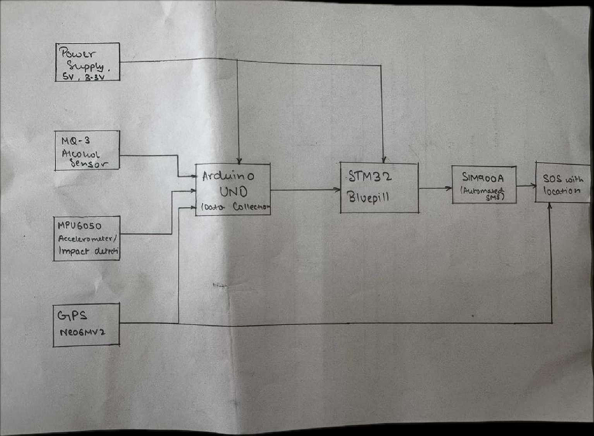
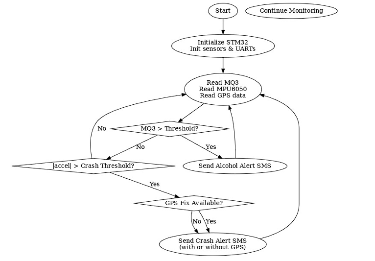

# smart-motorcycle-helmet

STM32-based smart motorcycle helmet system designed to improve rider safety through alcohol detection, accident detection, GPS tracking, and GSM-based emergency alerts.

## Project Overview

Road accidents caused by drunk driving and delayed emergency response remain a major safety concern. This project proposes a Smart Motorcycle Helmet that combines embedded sensors, GPS tracking, and GSM communication to improve rider safety and provide immediate assistance during emergencies.

The system continuously monitors rider conditions using multiple sensors and automatically sends emergency alerts with location details whenever a crash is detected.

## Objectives

* Detect alcohol consumption before riding
* Identify accidents using motion and impact sensing
* Track rider location using GPS
* Send emergency alerts through GSM communication
* Improve road safety using embedded and IoT technologies

## System Architecture



*Figure 1: Block diagram of the Smart Motorcycle Helmet system.*

## Working Principle

1. System initializes all sensors and communication modules.
2. MQ-3 sensor monitors alcohol concentration.
3. MPU6050 continuously monitors motion and acceleration.
4. GPS module tracks real-time location.
5. If alcohol is detected, a warning alert is generated.
6. If a crash is detected, GPS coordinates are acquired.
7. GSM module sends an emergency SMS containing location details.
8. Monitoring continues until system shutdown.

## Flowchart



*Figure 2: Flowchart of Smart Motorcycle Helmet operation.*

## Hardware Components

### STM32 Bluepill


*Figure 3: STM32F103C8T6 Bluepill Microcontroller.*

### MQ-3 Alcohol Sensor


*Figure 4: MQ-3 Alcohol Detection Sensor.*

### MPU6050 Accelerometer & Gyroscope


*Figure 5: MPU6050 Motion Tracking Sensor.*

### NEO-6M GPS Module


*Figure 6: NEO-6M GPS Module.*

### SIM900A GSM Module


*Figure 7: SIM900A GSM Communication Module.*

## Software & Tools

* STM32 Bluepill (STM32F103C8T6)
* Arduino IDE
* Embedded C / C++
* TinyGPS++
* MPU6050 Library
* UART Communication
* GPS & GSM Technologies

## Program Code

Project source code is available in:

```text
code/smart_helmet_stm32.ino
```

## Prototype


*Figure 8: Smart Motorcycle Helmet Prototype.*

## Results

### Serial Monitor Output


*Figure 9: Serial monitor showing sensor readings and system status.*

### Testing Observations

| Condition           | Sensor Output     | System Action         |
| ------------------- | ----------------- | --------------------- |
| No alcohol detected | Below threshold   | Normal operation      |
| Alcohol detected    | Above threshold   | Warning generated     |
| Accident detected   | High acceleration | Emergency SMS sent    |
| Normal movement     | Stable readings   | Continuous monitoring |

## Features

* Alcohol Detection
* Accident Detection
* GPS Location Tracking
* GSM Emergency Alerts
* Real-Time Monitoring
* Low-Cost Embedded Solution
* Rider Safety Enhancement

## Applications

* Smart Transportation Systems
* Motorcycle Safety Systems
* Emergency Response Systems
* IoT-Based Safety Devices
* Intelligent Vehicle Monitoring

## Future Scope

* Automatic Engine Lock System
* Mobile Application Integration
* Cloud-Based Monitoring
* IoT Dashboard Connectivity
* Voice Assistance Features
* Machine Learning Based Accident Detection
* Helmet Wear Detection
* Solar-Powered Operation

## Project Report

Complete project documentation is available in:

```text
docs/smart-motorcycle-helmet-report.pdf
```

## Team Members

* Vraj Shah
* Rishabh Shaw
* Ansh Taralekar
* Mohd. Gibran Ulde

## Supervisor

Dr. Priya Hankare

## License

This repository is intended for academic and educational purposes.
